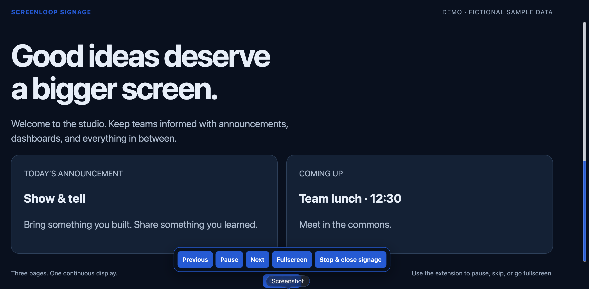
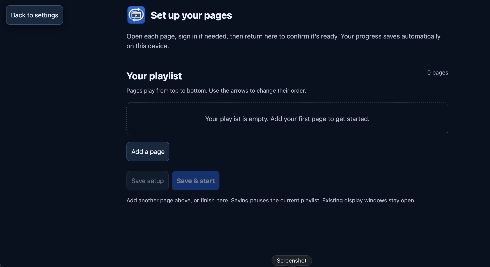
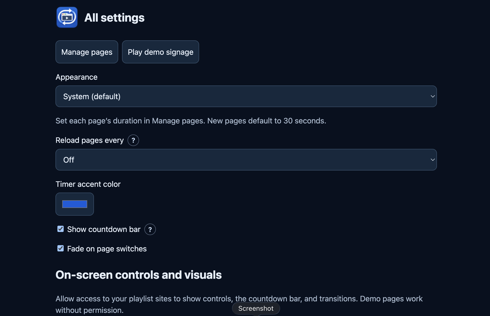

Built ScreenLoop Signage to turn everyday browser pages into a rotating fullscreen display for dashboards, announcements, and shared screens. It opens websites in normal Chrome tabs, using existing browser login sessions without requiring an iframe-based player, a dashboard API, or a separate server.

## Key Features

- **Flexible Playlists**: Add up to 50 websites, give pages clear names, reorder them, and set individual display times from 5 seconds to 10 minutes.
- **Fullscreen Playback**: Start signage fullscreen, pause or resume rotation, move between pages, and optionally refresh dashboards automatically.
- **Unobtrusive Controls**: Floating controls appear briefly at startup and return with pointer activity. Controls and the mouse pointer hide when idle, while page switches preserve their visibility timing.
- **Customizable Visuals**: Choose an accent color, use a slim frosted-glass countdown track, and soften page changes with a subtle fade. Single-page displays use an activity indicator instead of a countdown.
- **Light and Dark Appearance**: Extension pages follow the browser’s appearance preference by default, with manual Light and Dark options.
- **Guided Setup**: Open each website, sign in directly if needed, and confirm it is ready. Setup drafts save locally, and optional site permissions enable on-screen controls.
- **Local-Only Settings**: Playlists and preferences stay in Chrome’s extension storage. No analytics, advertising, or ScreenLoop backend receives this data.
- **Built-In Demo**: Three fictional demo pages let users try signage without signing in or configuring a website.

## Screenshots

### Signage playback

### Playlist setup

### Settings

### Extension popup

[Welcome screen](images/screenloop-extension-popup-no-page.png) · [Playback controls](images/screenloop-extension-popup-demo-running.png)

## How It Works

A Manifest V3 service worker coordinates browser tabs, playback state, and refresh schedules. Chrome alarms handle scheduled work, while short timers support page durations below 30 seconds with alarm recovery. Timing can be delayed if the computer sleeps or Chrome suspends the extension.

Optional website access enables the timer and playback overlays. If a signage page navigates to a different website, the extension can request access for that destination. Tab rotation remains available when optional website access is declined.

## Get the Extension

Version **2.0.0** is available on GitHub for manual installation. Chrome Web Store publication is pending.

1. Download the project from GitHub.
2. Open `chrome://extensions` and enable **Developer mode**.
3. Select **Load unpacked** and choose the project’s `chrome-extension` folder.
4. Open ScreenLoop Signage and choose **Set up my pages** or **Try demo**.

[View source and installation details on GitHub](https://github.com/BirajGtm/screenloop-signage)

[View the project website](https://birajgtm.com.np/project/screenloop-signage)

## Privacy and Support

Developed by **Biraj Gautam**.

[Read the Privacy Policy](https://birajgtm.com.np/project/screenloop-signage/privacy-policy)

For questions or support, email [support@birajgtm.com.np](mailto:support@birajgtm.com.np).
